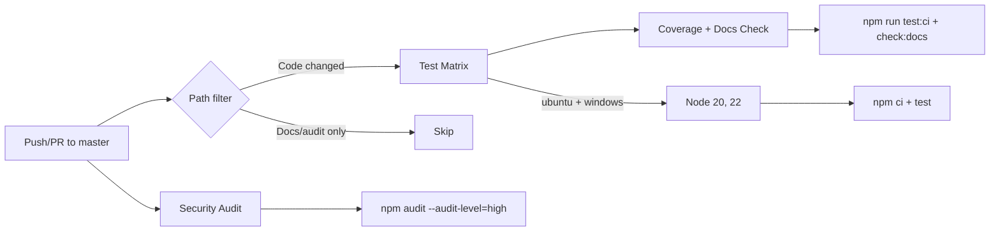

# DevOps & Infrastructure Audit Report

**Project**: NightyTidy v0.1.0
**Date**: 2026-03-10
**Run**: 02
**Branch**: `nightytidy/run-2026-03-10-1003`

---

## 1. Executive Summary

NightyTidy is a CLI orchestration tool with a well-structured GitHub Actions CI pipeline (created in audit run 01). The project has no database, no deploy pipeline, no Docker, and minimal configuration surface (one env var). This audit found **three CI optimizations** (one implemented), confirmed logging quality as **good**, and verified the environment configuration is appropriate for the tool's scope.

**Top 5 findings (by impact):**
1. **`check:docs` ran 4x instead of 1x** — moved to coverage job (saves ~3 redundant runs per CI trigger)
2. **No concurrency groups** — added to cancel superseded pipeline runs on rapid pushes
3. **`audit-reports/**` not in path filters** — adding audit report files triggered full CI unnecessarily
4. **Logging quality is good** — consistent level usage, no sensitive data exposure, proper fallbacks
5. **No database, no migrations, no secrets** — phases 4 and parts of phase 2 are not applicable

**Changes implemented**: CI concurrency groups, `check:docs` deduplication, path filter for audit-reports.

---

## 2. CI/CD Pipeline

### Pipeline Map

**File**: `.github/workflows/ci.yml`

| Job | Runs on | Depends on | Steps | Estimated duration |
|-----|---------|-----------|-------|-------------------|
| `test` | ubuntu-latest, windows-latest × Node 20, 22 (4 combos) | — | checkout, setup-node (cached), npm ci, npm test | ~30s each |
| `coverage` | ubuntu-latest, Node 22 | `test` | checkout, setup-node (cached), npm ci, test:ci, check:docs | ~40s |
| `security` | ubuntu-latest, Node 22 | — | checkout, setup-node (cached), npm ci, npm audit | ~15s |

**Caching**: All jobs use `actions/setup-node@v4` with `cache: npm`, caching the npm tarball cache. This is effective — `npm ci` resolves from cache on repeat runs.

### Optimizations Implemented

| Change | Before | After | Estimated savings |
|--------|--------|-------|-------------------|
| `check:docs` deduplication | Ran in all 4 test matrix entries | Runs once in coverage job | ~15s per CI run (3 redundant runs removed) |
| Concurrency groups | All pushes ran full pipeline | Superseded runs cancelled | Varies — saves full pipeline cost on rapid pushes |
| `audit-reports/**` path filter | Audit report commits triggered CI | Filtered out | ~2 min per audit report commit |

### Larger Recommendations (Not Implemented)

| Recommendation | Impact | Effort | Risk |
|----------------|--------|--------|------|
| Combine coverage into test matrix (ubuntu/22 entry) | Eliminates 1 redundant npm ci + test run | Medium — requires matrix.include logic | Low — may complicate matrix readability |
| Add `npm audit` to lockfile-only changes | Catch dependency vulnerabilities on lockfile PRs | Low — add paths filter | None |
| Cache node_modules via actions/cache for Windows | Windows npm ci is slower (~10s vs ~5s on Linux) | Low | Low |

---

## 3. Environment Configuration

### Variable Inventory

| Variable | Used In | Default | Required | Description | Issues |
|----------|---------|---------|----------|-------------|--------|
| `NIGHTYTIDY_LOG_LEVEL` | `logger.js:22` | `info` | No | Log verbosity: debug, info, warn, error | None — validates and warns on invalid values |
| `CLAUDECODE` | `claude.js:30`, `checks.js:4` | (set by Claude Code) | No | Stripped by `cleanEnv()` to prevent nested session blocking | None — internal concern, well-documented |

### Issues Found

**None.** The configuration surface is minimal by design (CLI tool, not a service). The single env var has:
- Validation with warning on invalid values (`logger.js:23-27`)
- Sensible default (`info`)
- Documentation in CLAUDE.md

### Secret Management Assessment

**Not applicable.** NightyTidy stores no secrets. Claude Code manages its own authentication. The `--dangerously-skip-permissions` flag is a CLI argument (not a secret) and is documented in CLAUDE.md with rationale.

### Kill Switch / Operational Toggle Inventory

| Toggle | Controls | Change Mechanism | Latency | Documented? |
|--------|----------|-----------------|---------|-------------|
| `--dry-run` | Skips execution, shows plan | CLI flag | Immediate | Yes (CLAUDE.md) |
| `--timeout <min>` | Per-step timeout (default 45 min) | CLI flag | Immediate | Yes (CLAUDE.md) |
| `--steps N,N,N` | Limits which steps run | CLI flag | Immediate | Yes (CLAUDE.md) |
| `NIGHTYTIDY_LOG_LEVEL` | Log verbosity | Env var (restart) | Restart | Yes (CLAUDE.md) |
| SIGINT (Ctrl+C) | Graceful abort — finishes current step, generates partial report | Signal | Immediate | Yes (cli.js) |
| Dashboard stop button | Sends abort signal via CSRF-protected POST | HTTP POST | Immediate | Yes (dashboard.js) |

### Missing Kill Switches

| Feature/Dependency | Risk if Unavailable | Recommendation |
|--------------------|-------------------|----------------|
| Claude Code API | Cannot disable Claude Code calls without killing the process | Low risk — SIGINT handles this adequately |

**Assessment**: The kill switch coverage is appropriate. SIGINT provides immediate abort, `--timeout` prevents runaway steps, and the dashboard stop button provides a GUI escape hatch.

### Production Safety

**Not applicable in traditional sense** — NightyTidy is a local CLI tool, not a deployed service. There are no production vs. dev environments, no CORS, no rate limits, no monitoring keys.

The tool does enforce safety:
- Git safety tag before any changes
- Dedicated run branch (never modifies the working branch directly)
- Ephemeral files excluded from git tracking
- Lock file prevents concurrent runs
- CSRF protection on dashboard HTTP server
- Prompt integrity hash verification

---

## 4. Logging

### Maturity Assessment: **Good**

| Criterion | Rating | Notes |
|-----------|--------|-------|
| Consistent library usage | Excellent | All modules use `logger.js` — no rogue logging |
| Level appropriateness | Good | debug for internals, info for milestones, warn for recoverable, error for failures |
| Timestamps | Good | ISO 8601 format on every line |
| Sensitive data | Excellent | No passwords, tokens, PII, or credentials logged |
| Error context | Good | Error messages include step numbers, attempt counts, durations |
| Structured logging | Fair | Plain text with `[TIMESTAMP] [LEVEL] message` format — adequate for CLI |
| Log destinations | Good | File + stdout (with quiet mode for orchestrator JSON output) |
| Fallback handling | Good | Logger falls back to stderr if file write fails (`logger.js:46-48`) |

### Console.log Usage

`console.log` is used in `cli.js` and `cli-ui.js` for terminal UX output (welcome banners, spinner text, completion summaries). This is **intentional and documented** in CLAUDE.md: "No bare `console.log` in production code — use logger (exception: `cli.js` terminal UX output)".

### Empty Catch Blocks

Found ~40 `catch { /* comment */ }` patterns across the codebase. All are intentional:
- `/* already gone */` — file cleanup that tolerates already-deleted files
- `/* non-critical */` — dashboard/progress updates that must not crash the run
- `/* best effort */` — error-path cleanup
- `/* ignore */` — SSE client disconnect handling

Each has a comment explaining why the error is swallowed. This follows the documented error handling contracts (CLAUDE.md "Error Handling Strategy" table).

### Sensitive Data Findings

**NONE.** No credentials, tokens, passwords, PII, or API keys are logged anywhere. Claude Code handles its own authentication externally — NightyTidy never sees or stores auth tokens.

### Coverage Gaps

| Gap | Severity | Notes |
|-----|----------|-------|
| No request-level correlation IDs | N/A | Sequential CLI tool — correlation IDs not applicable |
| No log rotation | Low | Log file is ephemeral per-run, deleted on next run |
| Synchronous file appends | Low | `appendFileSync` — fine for ~50 entries/step, would matter at scale |

---

## 5. Database Migrations

**Not applicable.** NightyTidy has no database, no ORM, no migration files, and no schema definitions. It is a pure CLI tool that operates on files and git repositories. State is managed via:
- Ephemeral JSON files (`nightytidy-progress.json`, `nightytidy-run-state.json`)
- Git tags and branches
- Atomic lock files

No migration safety analysis is needed.

---

## 6. Recommendations

| # | Recommendation | Impact | Risk if Ignored | Worth Doing? | Details |
|---|---|---|---|---|---|
| 1 | Combine coverage into test matrix entry | Eliminates 1 redundant npm ci + full test run (~30s) | Low | Only if time allows | Use `matrix.include` to add `--coverage` flag to ubuntu/Node 22 entry. Saves one full test:ci re-run but complicates the matrix config. Current overhead is ~30s — not painful. |
| 2 | Add Node.js version to lockfile | Prevents "works on my machine" npm ci differences | Low | Probably | Add `engines.npm` or use `.nvmrc` / `.node-version` file. Ensures CI and local dev use the same Node version for `npm ci`. |
| 3 | Add structured JSON log option | Easier log parsing for automated analysis | Low | Only if time allows | Add `--log-format json` flag for structured output. Current plain text is fine for human reading and the scale of this tool. |

---

*Generated by NightyTidy DevOps Audit — Run 02, 2026-03-10*
